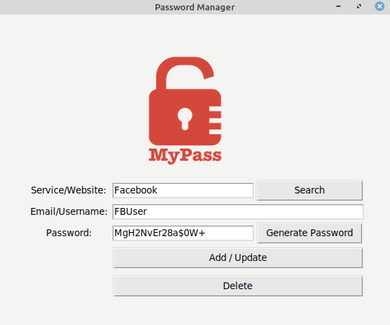

#### Password Manager

Stores logins and passwords to webservices in json file on local machine.

Manager allows add, view, update or delete data. You can also generate strong random password containing letters, symbols and numbers.

